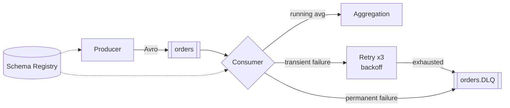

# Kafka Avro Order Pipeline

A Kafka system that produces and consumes **order messages** using **Avro
serialization** (with Confluent Schema Registry). The consumer keeps a **running
average of prices**, **retries transient failures**, and sends permanently failed
messages to a **Dead Letter Queue (DLQ)**.

---

## Architecture



## Schema (`schemas/order.avsc`)

| Field   | Type   | Description               |
| ------- | ------ | ------------------------- |
| orderId | string | Unique order identifier   |
| product | string | Purchased item name       |
| price   | float  | Product price (randomized)|

> `price` is `float` per the spec. Production systems would use a decimal type for
> money to avoid rounding error.

## Structure

```
order-streaming/
├── docker-compose.yml     # Kafka (KRaft) + Schema Registry + UI
├── schemas/order.avsc
├── common/config.py       # shared settings
├── producer/producer.py   # generate + Avro-serialize orders
└── consumer/
    ├── consumer.py        # deserialize, aggregate, retry, DLQ
    ├── aggregator.py      # running average
    └── errors.py          # Transient / Permanent errors
```

---

## Key Design Choices

- **Avro via Schema Registry** : schema auto-registers on first produce (subject
  `orders-value`); messages use the Confluent wire format.
- **Transient vs. permanent failures** : transient (e.g. timeout) is retried;
  permanent (e.g. invalid data) goes straight to the DLQ. No wasted retries.
- **Exponential backoff** : 3 retries at `0.5s → 1s → 2s`.
- **Manual offset commits** (`enable.auto.commit=false`) : commit only after a
  message is processed or DLQ'd, giving at-least-once semantics.
- **DLQ payload is JSON** with error type, original topic/partition/offset, and the
  raw bytes as hex, useful for debugging and replay.

---

## Setup

```bash
# 1. Infrastructure
docker compose up -d
docker compose ps

# 2. Topics
docker exec kafka kafka-topics --create --topic orders \
  --bootstrap-server localhost:9092 --partitions 3 --replication-factor 1
docker exec kafka kafka-topics --create --topic orders.DLQ \
  --bootstrap-server localhost:9092 --partitions 3 --replication-factor 1

# 3. Dependencies
python -m venv .venv
.\.venv\Scripts\Activate.ps1        # Windows  (macOS/Linux: source .venv/bin/activate)
pip install -r requirements.txt
```

> UI port conflict? Change `kafka-ui` to `"8090:8080"` in `docker-compose.yml`. The
> UI is optional.

## Run

From `order-streaming`, venv activated, in two terminals:

```bash
python -m producer.producer     # terminal 1
python -m consumer.consumer     # terminal 2
```

## Verify

```bash
# Avro schema registered
curl.exe http://localhost:8081/subjects            # -> ["orders-value"]

# DLQ contents (readable JSON)
docker exec kafka kafka-console-consumer --topic orders.DLQ \
  --bootstrap-server localhost:9092 --from-beginning --max-messages 5
```

`MAX_RETRIES`, `RETRY_BASE_DELAY`, and `TRANSIENT_FAILURE_RATE` are tunable in
`consumer/consumer.py`.

## Cleanup

```bash
docker compose down -v
```
